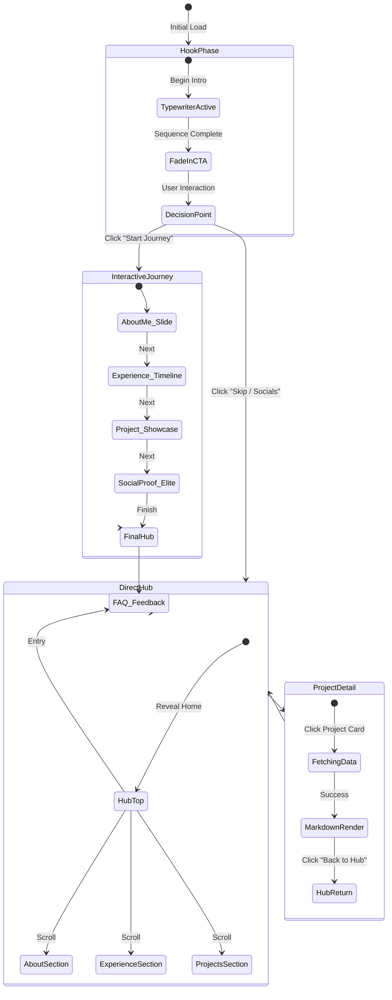

# User Flow & Interaction Logic: Live Digital Portfolio

This document maps the technical transitions and visual state changes for the portfolio. This serves as our "Interaction Wireframe."

## 🎭 1. The Core Interaction Flow

---

## 🛠️ 2. Detailed Interaction Specs

### A. The Hook Sequence
1.  **Stage 1 (Pure Darkness/Minimal)**: 
    - Full-screen text starts typing: *"This is a live system..."*
    - Real-time counter at top-right starts from 0 and ticks up rapidly.
2.  **Stage 2 (The Reveal)**: 
    - Text finishes typing.
    - `|` cursor blinks 3 times.
    - Two buttons fade in: `[Start Interactive Journey]` (Primary/Glowing) and `[Quick Browse]` (Secondary/Ghost).

### B. The "Suggestive Nudge" Mechanics
- **Scenario**: User is in `DirectHub` and scrolls past `InteractiveJourney` entry point.
- **Trigger**: User reaches `ExperienceSection`.
- **Response**: A small floating tooltip or sidebar element appears: 
    - *Text*: "Want the full story? Jump into the Interactive Journey."
    - *Action*: Pulsing animation on the Journey icon.

### C. The Project Transition (Hub -> Project)
1.  **User Trigger**: Click project card.
2.  **State Change**:
    - Current URL updates to `/project/:id`.
    - Hero image of total project expands to full-screen background (briefly).
    - Content fades in from the bottom.
3.  **Exit Strategy**: "Back to Hub" button smooth-scrolls the user back to the *exact* Project Card position on the homepage.

---

## 🏗️ 3. Component Interaction States

| Component | Neutral State | Hover/Active State | Interaction Result |
| :--- | :--- | :--- | :--- |
| **Journey Button** | Static Ghost | Glowing Solid | Mounts Journey Component |
| **Project Card** | Glassmorphism | Shadow Expansion | Navigates to dedicated page |
| **Live Counter** | Static Number | Pulsing (on Join) | Visual feedback of traffic |
| **Command Palette** | Hidden | Modal Overlay | Instant Search/Nav |

---

## 📋 4. Interaction To-Do (Verification)
- [ ] Logic for tracking "Return to Hub" scroll position.
- [ ] Typewriter "Deletable" sequence script.
- [ ] Dual-layer rate-limiter response (Shadow-ban UI notification).
